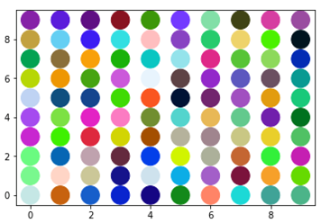
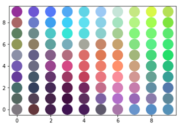

## self_organizing_map

The Self-Organizing Map is an unsupervised learning technique. Inspired by the sensory activation patterns of the human cerebral cortex,
the map is trained using a heuristic method which is capable of discovering hidden non-linear structure in high dimensional data.

Thus Kohonen network  maps  input vectors (patterns) of arbitrary dimension N onto a discrete map with 1 or 2 dimensions.
Patterns close to one another in the input space should be close to one another in the map: ordered topologically.

This implementation uses a random set of 3 dimensional data. Every data point consists of rgb values. The SOM is used to generate a topological ordering according to the colors of the data point.

## Dependencies
* Numpy
* Matplotlib

## Reference
[1]. Beale, Russell, and Tom Jackson. Neural Computing-an introduction. CRC Press, 1990.

[2]. Kohonen, Teuvo. "The self-organizing map." Proceedings of the IEEE 78.9 (1990): 1464-1480.
